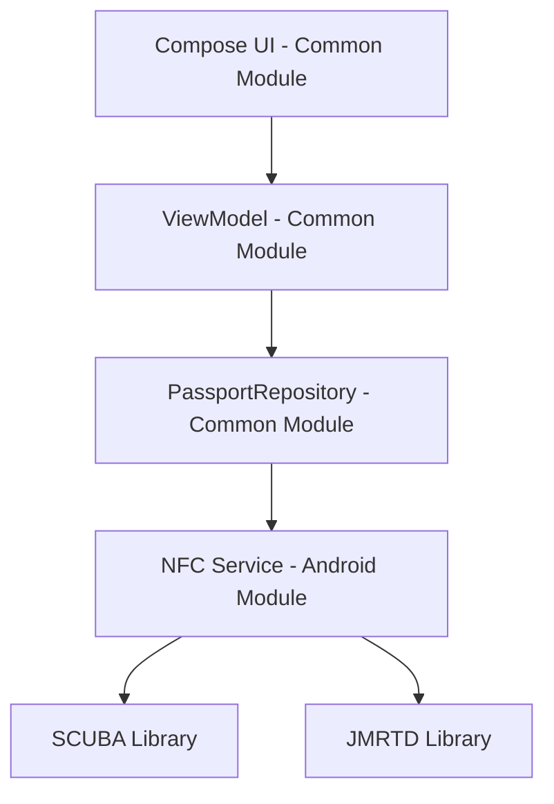

# Design Document

## Overview

The Passport NFC Simulator is a Kotlin Multiplatform application that emulates a passport NFC chip using Android's Host Card Emulation (HCE) capabilities. The application provides a Compose-based UI for entering passport details and uses SCUBA and JMRTD libraries to handle BAC and PACE authentication protocols. The architecture separates platform-specific NFC operations from shared business logic and UI components.

## Architecture

### High-Level Architecture



### Module Structure

- **Common Module**: Shared UI, ViewModels, data models, and business logic
- **Android Module**: Platform-specific NFC implementation, HCE service, and Android-specific dependencies

### Key Architectural Patterns

- **MVVM**: ViewModel manages UI state and coordinates with repository
- **Repository Pattern**: Abstracts data operations and NFC communication
- **Dependency Injection**: Platform-specific implementations injected into common code
- **State Management**: Compose state management for reactive UI updates

## Components and Interfaces

### Core Components

#### 1. PassportData (Common Module)
```kotlin
data class PassportData(
    val passportNumber: String,
    val dateOfBirth: LocalDate,
    val expiryDate: LocalDate,
    val issuingCountry: String = "NLD", // Default for testing
    val nationality: String = "NLD"
) {
    fun toMrzData(): String // Generate MRZ string for BAC/PACE
    fun isValid(): Boolean // Validate all fields
}
```

#### 2. NfcSimulatorRepository (Common Module Interface)
```kotlin
interface NfcSimulatorRepository {
    suspend fun startSimulation(passportData: PassportData): Result<Unit>
    suspend fun stopSimulation(): Result<Unit>
    fun getSimulationStatus(): Flow<SimulationStatus>
    fun getNfcEvents(): Flow<NfcEvent>
}
```

#### 3. PassportSimulatorViewModel (Common Module)
```kotlin
class PassportSimulatorViewModel(
    private val repository: NfcSimulatorRepository
) : ViewModel() {
    val uiState: StateFlow<PassportSimulatorUiState>
    val nfcEvents: StateFlow<List<NfcEvent>>
    
    fun updatePassportData(data: PassportData)
    fun startSimulation()
    fun stopSimulation()
    fun clearEvents()
}
```

#### 4. NfcHceService (Android Module)
```kotlin
class PassportHceService : HostApduService() {
    override fun processCommandApdu(commandApdu: ByteArray, extras: Bundle?): ByteArray
    override fun onDeactivated(reason: Int)
    
    private fun handleSelectCommand(apdu: ByteArray): ByteArray
    private fun handleBacAuthentication(apdu: ByteArray): ByteArray
    private fun handlePaceAuthentication(apdu: ByteArray): ByteArray
}
```

### UI Components

#### 1. PassportInputForm
- Text fields for passport number, birth date, expiry date
- Validation indicators and error messages
- Date pickers for date fields
- Form validation state management

#### 2. SimulationControlPanel
- Start/Stop simulation buttons
- Simulation status indicator
- NFC availability status
- Permission request handling

#### 3. EventLogDisplay
- Real-time display of NFC events
- Scrollable list with timestamps
- Event filtering and clearing options
- Connection status indicators

## Data Models

### PassportSimulatorUiState
```kotlin
data class PassportSimulatorUiState(
    val passportData: PassportData = PassportData.empty(),
    val isSimulationActive: Boolean = false,
    val nfcAvailable: Boolean = false,
    val hasNfcPermission: Boolean = false,
    val validationErrors: Map<String, String> = emptyMap(),
    val isLoading: Boolean = false,
    val errorMessage: String? = null
)
```

### NfcEvent
```kotlin
data class NfcEvent(
    val timestamp: Instant,
    val type: NfcEventType,
    val message: String,
    val details: Map<String, Any> = emptyMap()
)

enum class NfcEventType {
    CONNECTION_ESTABLISHED,
    BAC_AUTHENTICATION_REQUEST,
    PACE_AUTHENTICATION_REQUEST,
    AUTHENTICATION_SUCCESS,
    AUTHENTICATION_FAILURE,
    CONNECTION_LOST,
    ERROR
}
```

### SimulationStatus
```kotlin
enum class SimulationStatus {
    STOPPED,
    STARTING,
    ACTIVE,
    STOPPING,
    ERROR
}
```

## Error Handling

### Error Categories

1. **Validation Errors**: Invalid passport data format or values
2. **NFC Errors**: Hardware unavailable, permissions denied, HCE failures
3. **Protocol Errors**: BAC/PACE authentication failures, invalid APDU commands
4. **System Errors**: Library initialization failures, unexpected exceptions

### Error Handling Strategy

- **UI Level**: Display user-friendly error messages with actionable guidance
- **ViewModel Level**: Convert exceptions to UI state updates
- **Repository Level**: Wrap platform exceptions in domain-specific error types
- **Service Level**: Log detailed error information for debugging

### Error Recovery

- Automatic retry for transient NFC errors
- Graceful degradation when NFC is unavailable
- Clear error state when user corrects input
- Service restart capability for HCE failures

## Testing Strategy

### Unit Testing

#### Common Module Tests
- PassportData validation logic
- ViewModel state management
- MRZ generation and validation
- Date validation and formatting

#### Android Module Tests
- NFC permission handling
- HCE service APDU processing
- SCUBA/JMRTD integration
- Authentication protocol implementation

### Integration Testing

- End-to-end NFC communication simulation
- BAC and PACE protocol compliance
- UI state synchronization with NFC events
- Error handling across module boundaries

### Testing Tools and Frameworks

- **JUnit 5**: Unit testing framework
- **MockK**: Mocking library for Kotlin
- **Turbine**: Testing Flow emissions
- **Compose Testing**: UI component testing
- **Robolectric**: Android unit testing without emulator

### Test Data Strategy

- Predefined valid passport data sets
- Invalid data scenarios for validation testing
- Mock APDU command sequences
- Simulated NFC reader interactions

### Performance Testing

- Memory usage during long simulation sessions
- Response time for APDU command processing
- UI responsiveness during NFC operations
- Battery usage optimization validation

## Security Considerations

### Data Protection
- No real passport data storage
- In-memory only passport information
- Clear sensitive data on app termination
- No network communication of passport details

### NFC Security
- Validate all incoming APDU commands
- Implement proper authentication timeouts
- Log security events for monitoring
- Prevent unauthorized access to simulation controls

### Development Security
- Use test/dummy data only
- Clear documentation about testing purpose
- Implement safeguards against production misuse
- Regular security review of authentication implementations